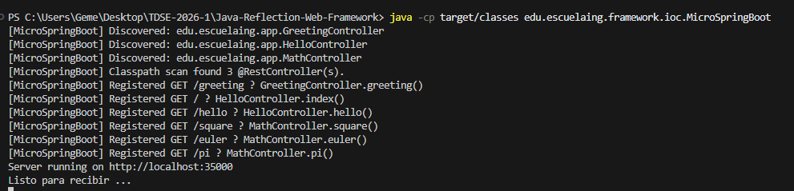
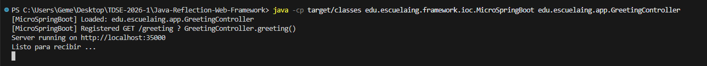
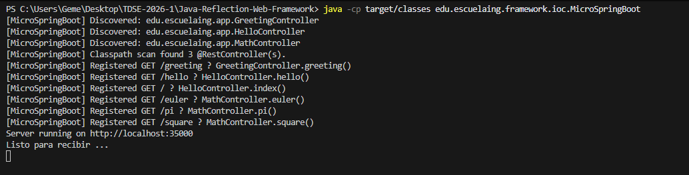
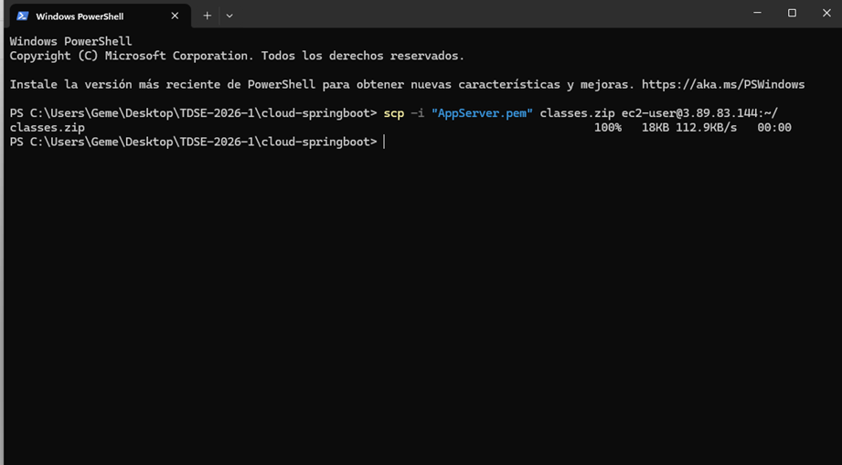
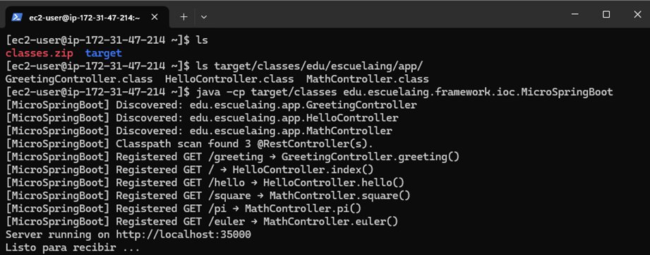
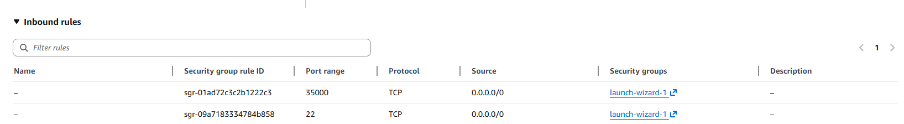

# Java Reflection Web Framework

A lightweight web server built in Java with IoC (Inversion of Control) capabilities based on reflection. The framework allows creating REST web applications from POJOs using annotations, similar to Spring Boot but implemented from scratch.

---

## Table of Contents
- [Project Description](#project-description)
- [Features](#features)
- [Architecture](#architecture)
- [Project Structure](#project-structure)
- [Requirements](#requirements)
- [Installation and Execution](#installation-and-execution)
- [Framework Usage](#framework-usage)
- [Controller Examples](#controller-examples)
- [Testing](#testing)
- [Evidence of Functionality](#evidence-of-functionality)

---

## Project Description

This project implements an **HTTP/1.1 web server** built from scratch using `ServerSocket`, capable of:
- Serving HTML pages and PNG images
- Providing an IoC framework to build web applications from POJOs
- Automatically loading beans through classpath scanning with reflection
- Supporting annotations: `@RestController`, `@GetMapping`, `@RequestParam`
- Handling multiple non-concurrent requests (multi-threaded)

### Workshop Compliance

The project meets all specified requirements:

1. **Initial version**: Load POJO from command line
   ```bash
   java -cp target/classes edu.escuelaing.framework.ioc.MicroSpringBoot edu.escuelaing.app.GreetingController
   ```

2. **Final version**: Automatic classpath scanning looking for classes annotated with `@RestController`
   ```bash
   java -cp target/classes edu.escuelaing.framework.ioc.MicroSpringBoot
   ```

---

## Features

### Supported Annotations

| Annotation | Description | Example |
|-----------|-------------|---------|
| `@RestController` | Marks a class as a web component | `@RestController public class HelloController { }` |
| `@GetMapping` | Maps a method to a GET route | `@GetMapping("/hello") public String hello() { }` |
| `@RequestParam` | Extracts parameters from query string | `@RequestParam(value = "name", defaultValue = "World")` |

### Server Capabilities

- **Static files**: Serves HTML, CSS, JS, PNG, JPG from `/webroot`
- **REST endpoints**: Methods annotated with `@GetMapping` returning `String`
- **Query parameters**: Automatic resolution with `@RequestParam` and default values
- **Java Reflection**: Dynamic instantiation and execution of controllers
- **Multi-threading**: Each HTTP request handled in a separate thread

---

## Architecture

```
┌─────────────────────────────────────────────────────────────────┐
│                      MicroSpringBoot (Main)                     │
│  1. Scans classpath looking for @RestController                │
│  2. Instantiates controllers via reflection                     │
│  3. Registers @GetMapping methods as routes in RouteRegistry   │
└────────────────────────────┬────────────────────────────────────┘
                             │
                             ▼
┌─────────────────────────────────────────────────────────────────┐
│                         HttpServer                              │
│              Listens on port 35000                              │
│              Creates thread per request                         │
└────────────────────────────┬────────────────────────────────────┘
                             │
            ┌────────────────┼────────────────┐
            ▼                ▼                ▼
    ┌──────────────┐  ┌─────────────┐  ┌─────────────┐
    │    REST      │  │   Static    │  │   Default   │
    │    Routes    │  │   Files     │  │ Hello World │
    │ RouteRegistry│  │   Handler   │  │             │
    └──────────────┘  └─────────────┘  └─────────────┘
```

### Execution Flow

1. **Startup**: `MicroSpringBoot.main()` scans `target/classes`
2. **Discovery**: Finds classes with `@RestController`
3. **Registration**: For each method with `@GetMapping`, registers a lambda in `RouteRegistry`
4. **Server**: `HttpServer` starts on port 35000
5. **Request**: Client makes HTTP request
6. **Dispatch**: 
   - If registered route exists → executes via reflection
   - If static file exists → serves the file
   - Otherwise → returns "Hello World!"

---

## Project Structure

```
src/
├── main/
│   ├── java/edu/escuelaing/
│   │   ├── app/                          # Example controllers
│   │   │   ├── GreetingController.java   # @RequestParam with defaultValue
│   │   │   ├── HelloController.java      # Simple endpoints
│   │   │   └── MathController.java       # Mathematical operations
│   │   └── framework/
│   │       ├── HttpServer.java           # HTTP/1.1 server
│   │       ├── Request.java              # HTTP request parser
│   │       ├── Response.java             # HTTP response
│   │       ├── Route.java                # Functional interface for routes
│   │       ├── RouteRegistry.java        # GET routes registry
│   │       ├── StaticFileHandler.java    # Static file service
│   │       ├── annotations/
│   │       │   ├── GetMapping.java       # Annotation to map GET
│   │       │   ├── RequestParam.java     # Annotation for parameters
│   │       │   └── RestController.java   # Annotation for controllers
│   │       └── ioc/
│   │           └── MicroSpringBoot.java  # IoC container / Entry point
│   └── resources/
│       └── webroot/
│           └── index.html                # Example HTML page
└── test/
    └── java/edu/escuelaing/framework/
        ├── AppTest.java                  # Framework tests
        └── IoCTest.java                  # Reflection/IoC tests
```

---

## Requirements

- **Java**: JDK 21 or higher
- **Maven**: 3.6+
- **Port**: 35000 (must be available)

---

## Installation and Execution

### 1. Clone the repository
```bash
git clone <REPOSITORY_URL>
cd Java-Reflection-Web-Framework
```

### 2. Compile the project
```bash
mvn clean compile
```

### 3. Run the server

#### Option A: No arguments (automatic scanning)
```bash
java -cp target/classes edu.escuelaing.framework.ioc.MicroSpringBoot
```

The framework will automatically scan all classes with `@RestController`.



#### Option B: With arguments (specify class)
```bash
java -cp target/classes edu.escuelaing.framework.ioc.MicroSpringBoot edu.escuelaing.app.GreetingController
```



### 4. Access the server

The server will be available at: **http://localhost:35000**


---

## Framework Usage

### Creating a REST Controller

```java
package edu.escuelaing.app;

import edu.escuelaing.framework.annotations.GetMapping;
import edu.escuelaing.framework.annotations.RequestParam;
import edu.escuelaing.framework.annotations.RestController;

@RestController
public class MyController {

    @GetMapping("/")
    public String index() {
        return "Hello from my controller!";
    }

    @GetMapping("/greet")
    public String greet(@RequestParam(value = "name", defaultValue = "World") String name) {
        return "Hello " + name + "!";
    }
}
```

### Annotation Rules

1. **@RestController**: 
   - Applied at class level
   - Marks the class for automatic discovery

2. **@GetMapping**:
   - Applied to public methods
   - Must specify a path: `@GetMapping("/path")`
   - Method must return `String`

3. **@RequestParam**:
   - Applied to method parameters
   - Requires `value` (parameter name in query string)
   - Optional `defaultValue` if parameter is not provided in request

---

## Controller Examples

### HelloController
Basic endpoints without parameters.

```java
@RestController
public class HelloController {
    
    @GetMapping("/")
    public String index() {
        return "Greetings from MicroSpringBoot!";
    }
    
    @GetMapping("/hello")
    public String hello() {
        return "Hello World!";
    }
}
```

**Tests:**
- `http://localhost:35000/` → "Greetings from MicroSpringBoot!"
- `http://localhost:35000/hello` → "Hello World!"




---

### GreetingController
Demonstrates `@RequestParam` with `defaultValue` (exact example from workshop specification).

```java
@RestController
public class GreetingController {
    
    private static final String template = "Hello, %s!";
    private final AtomicLong counter = new AtomicLong();
    
    @GetMapping("/greeting")
    public String greeting(@RequestParam(value = "name", defaultValue = "World") String name) {
        return "Hola " + name;
    }
}
```

**Tests:**
- `http://localhost:35000/greeting` → "Hola World"
- `http://localhost:35000/greeting?name=Daniel` → "Hola Daniel"


---

### MathController
Mathematical operations with parameters.

```java
@RestController
public class MathController {
    
    @GetMapping("/pi")
    public String pi() {
        return String.valueOf(Math.PI);
    }
    
    @GetMapping("/euler")
    public String euler() {
        return String.valueOf(Math.E);
    }
    
    @GetMapping("/square")
    public String square(@RequestParam(value = "value", defaultValue = "0") String value) {
        try {
            double n = Double.parseDouble(value);
            return String.valueOf(n * n);
        } catch (NumberFormatException e) {
            return "Error: 'value' must be a number";
        }
    }
}
```

**Tests:**
- `http://localhost:35000/pi` → "3.141592653589793"
- `http://localhost:35000/euler` → "2.718281828459045"
- `http://localhost:35000/square?value=5` → "25.0"

[INSERT_math_controller]


---

## Testing

### Run Automated Tests

```bash
mvn test
```

The project includes 39 tests that verify:
- Request parsing (path, query params)
- Response configuration (status, content-type)
- Route registration in RouteRegistry
- Lambda execution
- Static file Content-Type
- Annotation detection (@RestController, @GetMapping, @RequestParam)
- Method invocation via reflection
- Parameter resolution with default values


---

## Design Decisions

### 1. RouteRegistry (formerly Spark)
Static class that maintains a `Map<String, Route>` with registered routes. Allows searching routes by path.

### 2. Reflection in MicroSpringBoot
- Recursively scans `target/classes`
- Loads classes with `URLClassLoader`
- Verifies `@RestController` with `isAnnotationPresent()`
- Instantiates with `getDeclaredConstructor().newInstance()`
- Registers methods with `@GetMapping`

### 3. Parameter Resolution
The `resolveParams()` method builds the argument array:
- Searches for `@RequestParam` annotation on each parameter
- Extracts value from query string via `Request.getValue()`
- If not present, uses `defaultValue` from annotation

### 4. Multi-threading
Each client connection is handled in a new thread:
```java
new Thread(() -> {
    try {
        handleClient(socket);
    } catch (Exception e) {
        e.printStackTrace();
    }
}).start();
```

### 5. Dispatch Order
1. Search in registered REST routes
2. Search for static file in `/webroot`
3. Return "Hello World!" by default (never 404)

---

## Technologies Used

- **Java 21**: Reflection, annotations, lambdas
- **Maven**: Build automation
- **JUnit 5**: Testing framework
- **ServerSocket**: HTTP server from scratch
- **URLClassLoader**: Dynamic class loading

---

## AWS Deployment

This section documents the deployment of the application on an AWS EC2 instance.

### Prerequisites

- AWS EC2 instance running (t3.micro or similar)
- Security Group configured to allow:
  - Port 22 (SSH)
  - Port 35000 (Application)
- .pem key file for SSH access
- Java 21+ installed on the EC2 instance

### Deployment Steps

#### 1. Compile and Package the Application

```bash
mvn clean package
```

This generates the compiled classes in `target/classes` and creates a JAR file.

#### 2. Prepare Files for Transfer

Create a deployment package with the compiled classes:

```bash
cd target
zip -r classes.zip classes/
```

**IMPORTANT**: 
- Keep your `.pem` key file in a **separate folder OUTSIDE the repository** (e.g., `C:\aws-keys\` or `~/aws-keys/`)
- The `.pem` file should **NEVER** be committed to Git (it's like your password!)
- The `classes.zip` file is also temporary and doesn't need to be in the repo

Alternatively, you can transfer the entire `target` directory or use the generated JAR file.

#### 3. Connect to EC2 Instance

Use SSH with your .pem key to connect to the instance:

```bash
ssh -i "your-key.pem" ec2-user@your-instance-public-ip
```

Replace:
- `your-key.pem` with your key file name
- `your-instance-public-ip` with your EC2 instance public IP (e.g., 3.89.83.144)


#### 4. Transfer Application to EC2

From your local machine, use SCP to transfer the files:

```bash
scp -i "your-key.pem" target/classes.zip ec2-user@your-instance-public-ip:~/
```

Or transfer the entire target directory:

```bash
scp -i "your-key.pem" -r target ec2-user@your-instance-public-ip:~/
```



#### 5. Install Java on EC2 (if not installed)

Connect to the instance and install Java 21:

```bash
# For Amazon Linux 2023
sudo yum install java-21-amazon-corretto -y

# Verify installation
java -version
```

#### 6. Extract and Run the Application

On the EC2 instance:

```bash
# If you transferred the zip file
unzip classes.zip

# Run the application
java -cp classes edu.escuelaing.framework.ioc.MicroSpringBoot
```

The server should start and listen on port 35000.



#### 7. Configure Security Group

Ensure your EC2 Security Group has an inbound rule allowing TCP traffic on port 35000:

- **Type**: Custom TCP
- **Port**: 35000
- **Source**: 0.0.0.0/0 (or your specific IP for security)



#### 8. Access the Application

Open a web browser and access:

```
http://your-instance-public-ip:35000
```

Test the endpoints:
- `http://your-instance-public-ip:35000/` - Main page
- `http://your-instance-public-ip:35000/hello` - Hello endpoint
- `http://your-instance-public-ip:35000/greeting?name=Daniel` - Greeting with parameter
- `http://your-instance-public-ip:35000/pi` - Math endpoint


---

## Author

**Student**: Daniel Alejandro Rodriguez Baracaldo  
**Course**: Enterprise Architectures 
**Date**: March 2026

---
